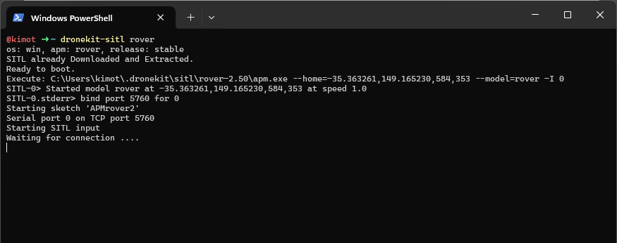

# Running 
To run the code on your machine, first run dronekit-sitl in your command line and then run the code in your IDE of choice as shown below:

### 1. Powershell command
Run this in your command line

`dronekit-sitl rover`

Screenshot example:

### 2. Run file in your IDE/ Code editor of choice.
Run the UGV Challenge_2 file.

# Conclusion
Logging is currently being done through printing in the command line but that is to be updated soon to the competition's recommended method.